# Web Application Document - Projeto Individual - Módulo 2 - Inteli


## Nome do Projeto:
### Easy Room

## Autor do projeto
**Miguel Ferreira de Siqueira Almeida**

## Sumário

1. [Introdução](#c1)  
2. [Projeto Técnico da Aplicação Web](#c3)  
3. [Desenvolvimento da Aplicação Web](#c4)  

<br>

## <a name="c1"></a>1. Introdução
Neste projeto, irei desenvolver um sistema web completo, com banco de dados, backend e frontend integrados. O objetivo é aplicar os conceitos que aprendi durante o módulo 2 do INTELI. A aplicação web desenvolvida será um sistema de reserva de salas para agendamentos, possibilitando que o usuário veja as salas disponíveis e escolha um dia e horário para fazer a reserva. O sistema contará com uma interface responsiva e mecanismos de validação de conflitos de horários, garantindo confiabilidade no processo de agendamento. A arquitetura do projeto será feita usando Node, JavaScript, CSS, HTML e um banco de dados relacional.

---

## <a name="c3"></a>2. Projeto da Aplicação Web

### 2.1. Modelagem do banco de dados  

### Modelo Relacional (Diagrama):


O diagrama apresentado representa três entidades principais: ```usuario, sala e reserva```. A entidade ```usuario``` contém as informações dos usuários do sistema, com os atributos **id_usuario (chave primária), nome e email**. Já a entidade ```sala``` armazena os dados das salas disponíveis para reserva, com os atributos **id_sala (chave primária), numero, localizacao, capacidade e um campo booleano disponivel**, que indica se a sala pode ou não ser reservada.

A tabela ```reserva``` é a entidade que registra os agendamentos realizados pelos usuários. Ela possui como **chave primária** o atributo **id_reserva e contém duas chaves estrangeiras: id_usuario, que referencia a tabela usuario, e id_sala, que referencia a tabela sala**. Além disso, há os campos **reservado_em**, que indica a data e hora em que a reserva foi feita, **data_inicio** e **data_fim**, que definem o período da reserva.

O relacionamento entre ```usuario``` e ```reserva``` é do tipo 1:N, o que significa que um único usuário pode efetuar várias reservas. Já o relacionamento entre ```sala``` e ```reserva``` também é do tipo 1:N, indicando que uma sala pode estar presente em várias reservas (em diferentes datas e horários). Esses relacionamentos são representados por **"EFETUA"** (um usuário efetua reservas) e **"CONTÉM"** (uma reserva contém uma sala).

Esse modelo garante que o sistema possa registrar quem fez cada reserva, qual sala foi reservada, e em quais horários, permitindo o controle de disponibilidade e evitando conflitos de agendamento.

### Modelo Físico

```
-- Criação Tabela "Usuário"
CREATE TABLE IF NOT EXISTS usuario (
  id_usuario SERIAL PRIMARY KEY,
  nome VARCHAR(100) NOT NULL,
  email VARCHAR (50) NOT NULL
);

-- Criação Tabela "Sala"
CREATE TABLE IF NOT EXISTS sala (
  id_sala SERIAL PRIMARY KEY,
  numero INTEGER NOT NULL, 
  localizacao varchar(100),
  capacidade INTEGER,
  disponivel BOOLEAN
);

-- Criação Tabela "Reserva"
CREATE TABLE IF NOT EXISTS reserva (
  id_reserva SERIAL PRIMARY KEY,
  id_usuario INTEGER NOT NULL,
  id_sala INTEGER NOT NULL,
  reservado_em TIMESTAMP NOT NULL,
  data_inicio TIMESTAMP NOT NULL,
  data_fim TIMESTAMP NOT NULL,
  FOREIGN KEY (id_usuario) REFERENCES usuario(id_usuario),
  FOREIGN KEY (id_sala) REFERENCES sala(id_sala)
);
```

### 2.1.1 BD e Models

##  Modelo de Usuário (`usuarioModel`)

Valida os dados fornecidos ao cadastrar ou atualizar um usuário.

- `id_usuario`: número inteiro positivo (opcional).
- `nome`: string obrigatória, entre 3 e 100 caracteres.
- `email`: string obrigatória, deve ser um e-mail válido com no máximo 50 caracteres.

> Utilizado para garantir que os usuários cadastrados possuam nome e e-mail válidos.

---

## Modelo de Sala (`salaModel`)

Valida os dados de uma sala disponível para reservas.

- `id_sala`: número inteiro positivo (opcional).
- `numero`: número da sala, obrigatório e inteiro positivo.
- `localizacao`: string com até 100 caracteres. Pode ser nula ou vazia.
- `capacidade`: número inteiro positivo. Pode ser nulo.
- `disponivel`: booleano que representa se a sala está disponível. Pode ser nulo.

> Permite a criação de registros de salas com informações básicas e opcionais para maior flexibilidade.

---

## Modelo de Reserva (`reservaModel`)

Valida os dados relacionados a uma reserva de sala feita por um usuário.

- `id_reserva`: número inteiro positivo (opcional).
- `id_usuario`: número inteiro positivo. Obrigatório. Refere-se ao usuário que realizou a reserva.
- `id_sala`: número inteiro positivo. Obrigatório. Refere-se à sala reservada.
- `reservado_em`: data em formato ISO. Obrigatória. Indica quando a reserva foi criada.
- `data_inicio`: data de início da reserva. Obrigatória. Formato ISO.
- `data_fim`: data de fim da reserva. Obrigatória. Deve ser igual ou posterior a `data_inicio`.

> Garante integridade temporal e vinculação correta entre usuários e salas reservadas.

---

- Todos os modelos utilizam a biblioteca [`Joi`](https://joi.dev/) para garantir que os dados estejam corretamente estruturados antes de qualquer operação no banco de dados.
- Campos opcionais são comuns para permitir a reutilização dos mesmos modelos em diferentes contextos (criação, atualização, consulta).
---

### 2.2. Arquitetura

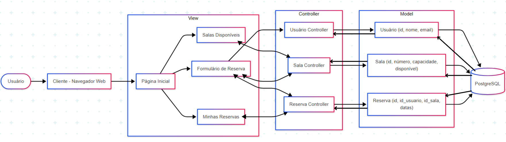

 **1. Interação do Usuário:**

O usuário acessa a aplicação pelo navegador (cliente).

**2. Navegação entre Views:**

Da Página Inicial, o usuário pode ir para:

- Salas Disponíveis

- Formulário de Reserva

- Minhas Reservas

 **3. Requisições da View para os Controllers:**

Salas Disponíveis → Sala Controller: solicita a lista de salas.

Formulário de Reserva → Sala Controller: carrega as salas disponíveis para reserva.

Formulário de Reserva → Usuário Controller: busca os dados do usuário (ex: nome, email).

Formulário de Reserva → Reserva Controller: envia os dados da nova reserva.

Minhas Reservas → Reserva Controller: solicita as reservas já feitas pelo usuário.

**4. Controllers acessam os Models:**

Usuário Controller → Usuário Model: busca ou grava dados do usuário.

Sala Controller → Sala Model: consulta ou atualiza informações das salas.

Reserva Controller → Reserva Model: cria ou recupera reservas.

**5. Models acessam o Banco de Dados:**

Usuário Model → PostgreSQL: acessa a tabela usuario.

Sala Model → PostgreSQL: acessa a tabela sala.

Reserva Model → PostgreSQL: acessa a tabela reserva.

**6. Retorno dos dados:**

O banco de dados envia os dados para os Models.

Os Models retornam as informações para os Controllers.

Os Controllers enviam os dados para a View.

A View exibe os dados no navegador para o usuário.

### 2.3. WebAPI e endpoints

 
Esta API RESTful permite o gerenciamento de reservas de salas através de três conjuntos de endpoints: `usuários`, `salas` e `reservas`. Todos os dados são enviados e recebidos no formato JSON.

##  Usuário

- **GET /api/usuarios**  
  Lista todos os usuários cadastrados.

- **POST /api/usuarios**  
  Cria um novo usuário.  
  **Exemplo de corpo da requisição:**
  ```json
  {
    "nome": "Ana Silva",
    "email": "ana@exemplo.com"
  }
  ```

- **DELETE /api/usuarios/:id**  
  Remove um usuário com base no seu ID.

---

## Sala

- **GET /api/salas**  
  Lista todas as salas cadastradas.

- **POST /api/salas**  
  Cria uma nova sala.  
  **Exemplo de corpo da requisição:**
  ```json
  {
    "nome": "Sala de Reunião A",
    "capacidade": 10,
    "disponivel": true
  }
  ```

- **GET /api/salas/:id**  
  Retorna os detalhes de uma sala específica.

- **PUT /api/salas/:id**  
  Atualiza os dados de uma sala com base no ID.

- **DELETE /api/salas/:id**  
  Remove uma sala do sistema.

---

## Reserva

- **GET /api/reservas**  
  Lista todas as reservas realizadas.

- **POST /api/reservas**  
  Cria uma nova reserva.  
  **Exemplo de corpo da requisição:**
  ```json
  {
    "idUsuario": 1,
    "idSala": 2,
    "dataInicio": "2024-12-01T09:00:00",
    "dataFim": "2024-12-01T11:00:00"
  }
  ```

- **GET /api/reservas/:id**  
  Exibe os detalhes de uma reserva específica.

- **PUT /api/reservas/:id**  
  Atualiza os dados de uma reserva.

- **DELETE /api/reservas/:id**  
  Remove uma reserva com base no ID.

##  Exemplos de uso com `curl`

#### ➤ Criar um usuário
```bash
curl -X POST http://localhost:3000/api/usuarios \
     -H "Content-Type: application/json" \
     -d '{"nome":"Ana Silva","email":"ana@exemplo.com"}'
```

#### ➤ Criar uma sala
```bash
curl -X POST http://localhost:3000/api/salas \
     -H "Content-Type: application/json" \
     -d '{"nome":"Sala de Reunião A","capacidade":10,"disponivel":true}'
```

#### ➤ Criar uma reserva
```bash
curl -X POST http://localhost:3000/api/reservas \
     -H "Content-Type: application/json" \
     -d '{"idUsuario":1,"idSala":1,"dataInicio":"2024-12-01T09:00:00","dataFim":"2024-12-01T11:00:00"}'
```

#### ➤ Listar as salas disponíveis
```bash
curl http://localhost:3000/api/salas-disponiveis
```

#### ➤ Listar as reservas detalhadas
```bash
curl http://localhost:3000/api/reservas-detalhadas
```

---
### 2.4 Interface e Navegação

Nessa etapa do projeto, foi desenvolvido o front-end do sistema web de Reserva de Salas, utilizando EJS, CSS Bootstrap e Javascript, tornando a interface intuitiva, simples e funcional, estando conectada efetivamente com o back-end e com o banco de dados no Supabase.

#### ➤ O que foi entregue em termos de código e sistema:

- Arquitetura das views:
Foi estruturada a pasta views com subpastas para layouts, componentes e páginas específicas, seguindo uma organização modular para facilitar manutenção e escalabilidade.
---
- Layout base:
Criado o arquivo layout.ejs, que contém a estrutura HTML principal, importação do Bootstrap e um header simplificado com atalhos para as páginas, garantindo uniformidade visual.
---
- Páginas principais implementadas:
1. Página inicial (index.ejs): com botões para acessar as principais funcionalidades do sistema.

2. Salas Disponíveis (salas.ejs): exibe a lista de salas disponíveis, consumindo a API backend via fetch e mostrando dados como número, localização e capacidade.

3. Fazer Reserva (etapas em duas páginas: reservarUsuario.ejs e reservarDetalhes.ejs): formulário para identificação do usuário e posteriormente seleção da sala, data e horários para reserva, com envio dos dados via API REST.

4. Minhas Reservas (minhasReservas.ejs): página para o usuário consultar suas reservas mediante inserção de nome e e-mail, exibindo os dados obtidos do backend.
---
- Comunicação com backend:
Todas as páginas que exibem dados dinâmicos utilizam a API REST já implementada no backend, fazendo requisições assíncronas via fetch para buscar ou enviar dados, garantindo que a interface reflita o estado atual do sistema.
---
- Validação e feedback:
Os formulários possuem validações básicas no frontend e tratamento de erros retornados pelo backend, exibindo mensagens claras para o usuário em casos de falhas.
---
- Navegação:
A navegação entre páginas ocorre via rotas Express configuradas para renderizar views com dados dinâmicos, sem a necessidade de frameworks front-end pesados, facilitando a implementação e manutenção.

#### ➤ Prints das Páginas:

- Tela Inicial:
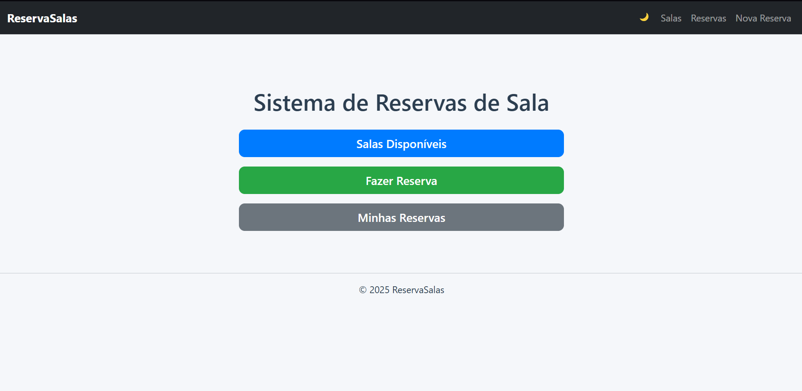
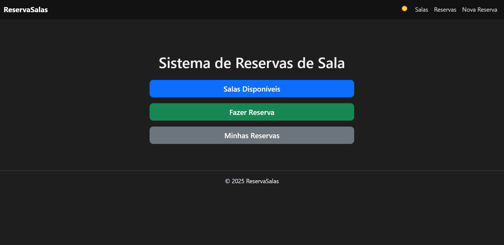

- Tela de Salas Disponíveis:
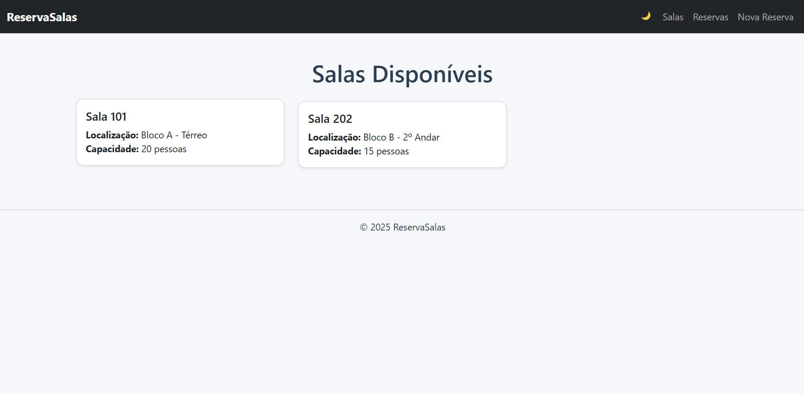
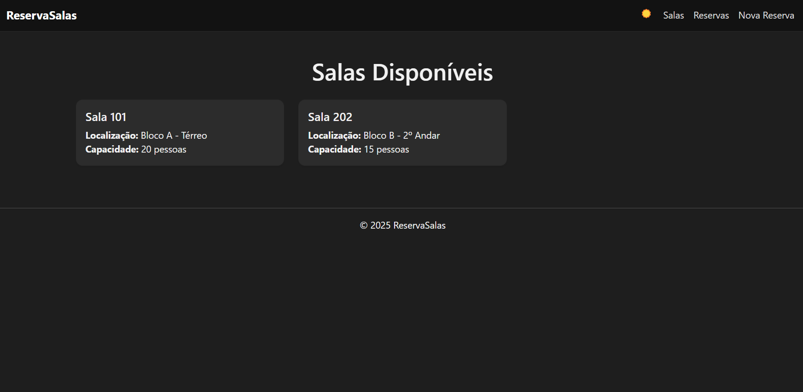

- Tela de Identificação Para Reservar:
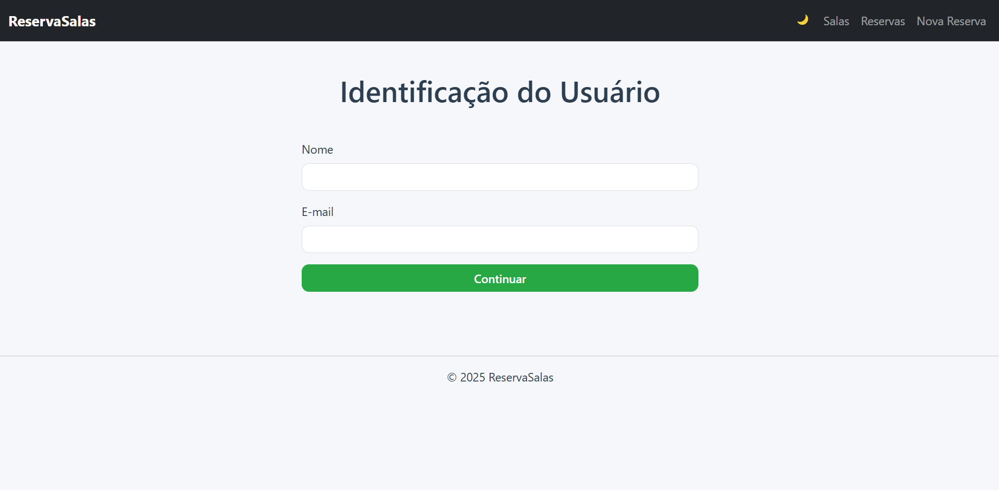
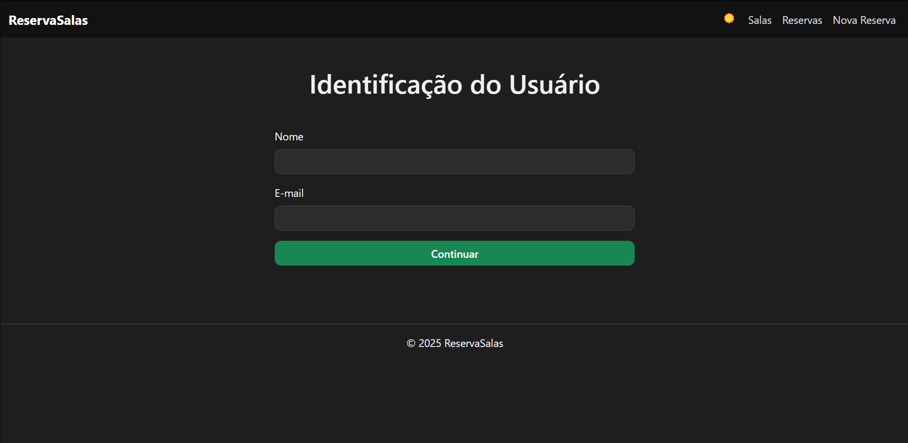

- Tela de Fazer Reserva:
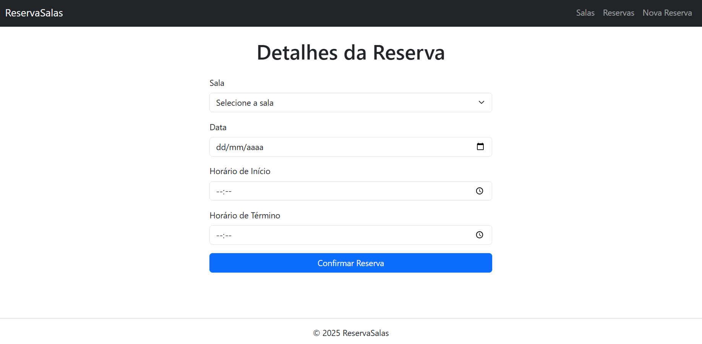
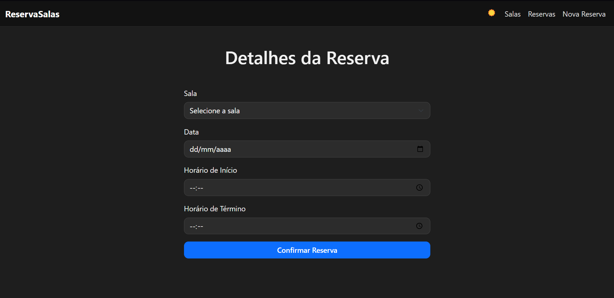

- Tela de Identificação Para Ver Reservas:
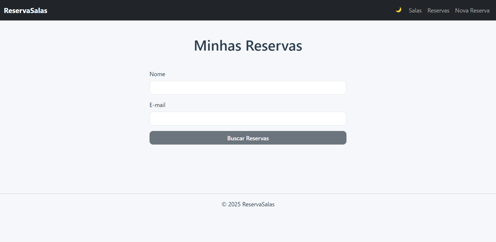
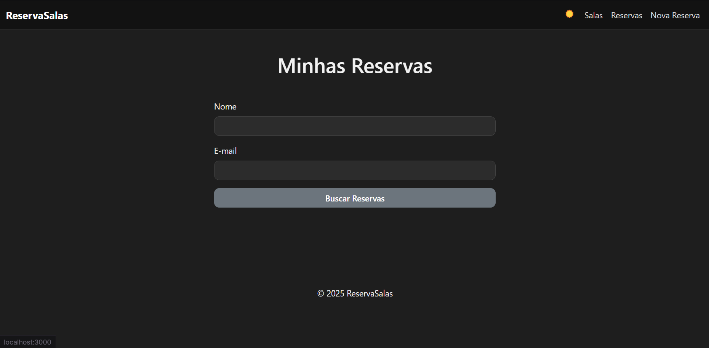

- Tela de Ver Reservas:
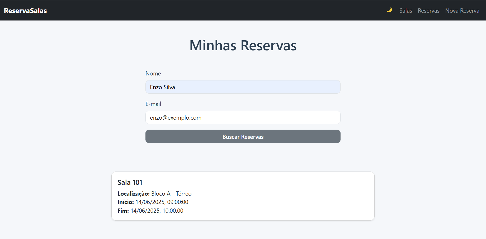
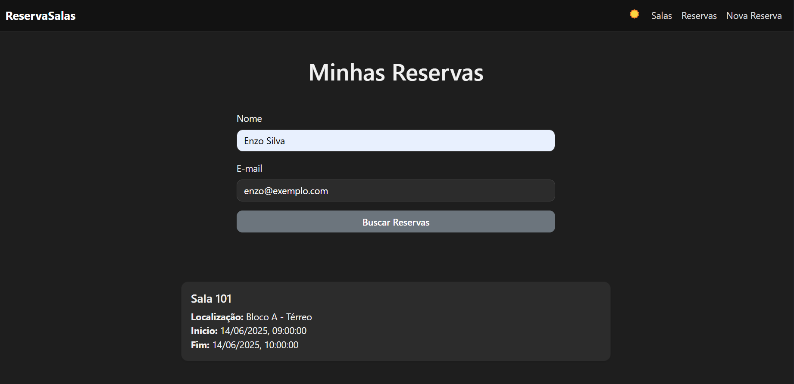
---

## <a name="c4"></a>3. Desenvolvimento da Aplicação Web

### 3.1 Demonstração do Sistema Web 

*VIDEO: Insira o link do vídeo demonstrativo nesta seção*
*Descreva e ilustre aqui o desenvolvimento do sistema web completo, explicando brevemente o que foi entregue em termos de código e sistema. Utilize prints de tela para ilustrar.*

### 3.2 Frameworks utilizados

- **Express.js:**
O Express.js facilita a criação de servidores web com Node.js, permitindo que você defina de forma simples rotas, respostas a requisições HTTP e middleware.

- **Bootstrap:**
O Bootstrap é utilizado junto com o HTML e o CSS para facilitar a criação de interfaces web. Ele fornece classes CSS prontas que são aplicadas diretamente nas tags HTML para definir o layout, as cores, os botões, os formulários e outros elementos visuais.

### 3.3 Banco de dados

Na aplicação, foi utlizado o PostgreSQL como banco de dados e o Supabase como plataforma de hospedagem e gerenciamento.

O PostgreSQL é o banco de dados em si, onde todas as informações da aplicação ficam armazenadas, como usuários, produtos, pedidos, etc. Ele é o responsável por organizar os dados em tabelas, garantir a segurança, a velocidade nas consultas e manter a integridade dos dados.

Já o Supabase funciona como uma plataforma que hospeda e gerencia o PostgreSQL. Além de fornecer a infraestrutura para manter o banco online, o Supabase oferece uma interface gráfica para visualizar os dados, ferramentas de autenticação, armazenamento de arquivos e APIs automáticas que facilitam a comunicação entre o banco de dados e a aplicação.

### 3.4 Conclusões e Trabalhos Futuros 

- **Pontos fortes:**

A interface da aplicação se destaca por sua intuitividade e fluidez, permitindo que qualquer usuário, mesmo sem experiência prévia, compreenda rapidamente como navegar e utilizar as funcionalidades. Os elementos são organizados de forma clara e objetiva, facilitando a tomada de decisão e a execução de tarefas. Outro diferencial é a presença do modo escuro, que proporciona maior conforto visual, especialmente para usuários que preferem ambientes com menor luminosidade, tornando a experiência mais agradável e acessível em diferentes contextos de uso.

- **Pontos a melhorar:**

Uma possível melhoria para a aplicação seria a implementação de novas funcionalidades e serviços complementares, ampliando a utilidade e a experiência do usuário. Entre as sugestões, destaca-se a possibilidade de contratar serviços adicionais para salas reservadas, como agendamento de limpeza antes ou depois do uso, ou ainda a solicitação de serviço de alimentação para um horário específico. Essas funcionalidades agregariam valor à plataforma e atenderiam a diferentes necessidades dos usuários, especialmente em contextos corporativos ou eventos. É importante, no entanto, que todas essas implementações sigam a identidade visual e a lógica de usabilidade já estabelecidas na interface, garantindo uma experiência coesa, funcional e visualmente harmoniosa.

### 3.5 Principais aprendizados e desafios superados

- **Principais aprendizados:**

Acredito que o projeto como um todo foi um grande aprendizado, desde a parte do backend até o frontend, coisas que não tinha ideia como fazer consegui aplicar nessa entrega final, a parte que mais senti evolução foi o frontend pois cheguei ao projeto com pouquíssimo conhecimento e agora pude aplicar uma interface limpa, didática e estilizada.

- **Desafios superados:**

O maior desafio foi a parte da criação dos endpoints, porém consegui superar passando a semana estudando para realizar a entrega, assisti vídeos, fiz autoestudos, assisti o vídeo do professor e ao final da semana consegui fazer, porém foi um caminho de muito esforço para aprender.

- **O que funcionou bem:**

Consegui aplicar muito bem os conhecimentos adquiridos durante o módulo, pude aplicar a teorica e consolidar os conhecimentos, acredito que pude equiibrar bastante todos os conhecimentos necessários, desde o backend até o frontend, então adquiri um conhecimento bem completo.

- **O que pode melhorar:**

Acredito que um ponto que posso melhorar é a minha gestão de tempo, durante essas semanas percebi que algumas vezes deixava para realizar as tarefas perto da data de entrega, causando uma sobrecarga desnecessária, porém não foi algo prejudicial para o projeto em sí.

---
---