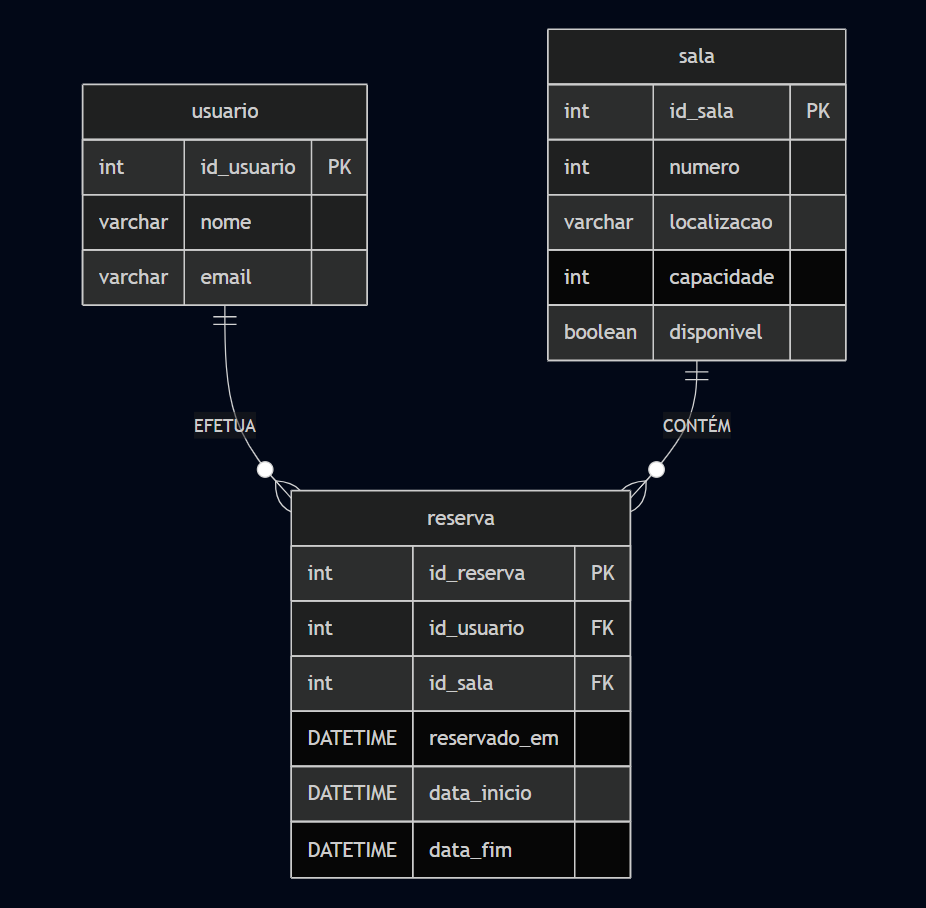

# Projeto Individual Módulo 02 - 2025
### Introdução: 
Neste projeto, irei desenvolver um sistema web completo, com banco de dados, backend e frontend integrados. O objetivo é aplicar os conceitos que aprendi durante o módulo 2 do INTELI.

### Diagrama do Modelo Relacional do Banco de Dados:
