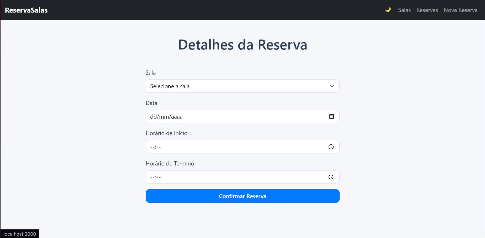

# Web Application Document - Projeto Individual - Módulo 2 - Inteli


## Nome do Projeto

## Autor do projeto
**Miguel Ferreira de Siqueira Almeida**

## Sumário

1. [Introdução](#c1)  
2. [Visão Geral da Aplicação Web](#c2)  
3. [Projeto Técnico da Aplicação Web](#c3)  
4. [Desenvolvimento da Aplicação Web](#c4)  
5. [Referências](#c5)  

<br>

## <a name="c1"></a>1. Introdução (Semana 01)
Neste projeto, irei desenvolver um sistema web completo, com banco de dados, backend e frontend integrados. O objetivo é aplicar os conceitos que aprendi durante o módulo 2 do INTELI. A aplicação web desenvolvida será um sistema de reserva de salas para agendamentos, possibilitando que o usuário veja as salas disponíveis e escolha um dia e horário para fazer a reserva. O sistema contará com uma interface responsiva e mecanismos de validação de conflitos de horários, garantindo confiabilidade no processo de agendamento. A arquitetura do projeto será feita usando Node, JavaScript, CSS, HTML e um banco de dados relacional.

---

## <a name="c2"></a>2. Visão Geral da Aplicação Web

### 2.1. Personas (Semana 01 - opcional)

*Posicione aqui sua(s) Persona(s) em forma de texto markdown com imagens, ou como imagem de template preenchido. Atualize esta seção ao longo do módulo se necessário.*

### 2.2. User Stories (Semana 01 - opcional)

*Posicione aqui a lista de User Stories levantadas para o projeto. Siga o template de User Stories e utilize a referência USXX para numeração (US01, US02, US03, ...). Indique todas as User Stories mapeadas, mesmo aquelas que não forem implementadas ao longo do projeto. Não se esqueça de explicar o INVEST de 1 User Storie prioritária.*

---

## <a name="c3"></a>3. Projeto da Aplicação Web

### 3.1. Modelagem do banco de dados  (Semana 3)

### Modelo Relacional (Diagrama):


O diagrama apresentado representa três entidades principais: ```usuario, sala e reserva```. A entidade ```usuario``` contém as informações dos usuários do sistema, com os atributos **id_usuario (chave primária), nome e email**. Já a entidade ```sala``` armazena os dados das salas disponíveis para reserva, com os atributos **id_sala (chave primária), numero, localizacao, capacidade e um campo booleano disponivel**, que indica se a sala pode ou não ser reservada.

A tabela ```reserva``` é a entidade que registra os agendamentos realizados pelos usuários. Ela possui como **chave primária** o atributo **id_reserva e contém duas chaves estrangeiras: id_usuario, que referencia a tabela usuario, e id_sala, que referencia a tabela sala**. Além disso, há os campos **reservado_em**, que indica a data e hora em que a reserva foi feita, **data_inicio** e **data_fim**, que definem o período da reserva.

O relacionamento entre ```usuario``` e ```reserva``` é do tipo 1:N, o que significa que um único usuário pode efetuar várias reservas. Já o relacionamento entre ```sala``` e ```reserva``` também é do tipo 1:N, indicando que uma sala pode estar presente em várias reservas (em diferentes datas e horários). Esses relacionamentos são representados por **"EFETUA"** (um usuário efetua reservas) e **"CONTÉM"** (uma reserva contém uma sala).

Esse modelo garante que o sistema possa registrar quem fez cada reserva, qual sala foi reservada, e em quais horários, permitindo o controle de disponibilidade e evitando conflitos de agendamento.

### Modelo Físico

```
-- Criação Tabela "Usuário"
CREATE TABLE IF NOT EXISTS usuario (
  id_usuario SERIAL PRIMARY KEY,
  nome VARCHAR(100) NOT NULL,
  email VARCHAR (50) NOT NULL
);

-- Criação Tabela "Sala"
CREATE TABLE IF NOT EXISTS sala (
  id_sala SERIAL PRIMARY KEY,
  numero INTEGER NOT NULL, 
  localizacao varchar(100),
  capacidade INTEGER,
  disponivel BOOLEAN
);

-- Criação Tabela "Reserva"
CREATE TABLE IF NOT EXISTS reserva (
  id_reserva SERIAL PRIMARY KEY,
  id_usuario INTEGER NOT NULL,
  id_sala INTEGER NOT NULL,
  reservado_em TIMESTAMP NOT NULL,
  data_inicio TIMESTAMP NOT NULL,
  data_fim TIMESTAMP NOT NULL,
  FOREIGN KEY (id_usuario) REFERENCES usuario(id_usuario),
  FOREIGN KEY (id_sala) REFERENCES sala(id_sala)
);
```

### 3.1.1 BD e Models (Semana 5)

##  Modelo de Usuário (`usuarioModel`)

Valida os dados fornecidos ao cadastrar ou atualizar um usuário.

- `id_usuario`: número inteiro positivo (opcional).
- `nome`: string obrigatória, entre 3 e 100 caracteres.
- `email`: string obrigatória, deve ser um e-mail válido com no máximo 50 caracteres.

> Utilizado para garantir que os usuários cadastrados possuam nome e e-mail válidos.

---

## Modelo de Sala (`salaModel`)

Valida os dados de uma sala disponível para reservas.

- `id_sala`: número inteiro positivo (opcional).
- `numero`: número da sala, obrigatório e inteiro positivo.
- `localizacao`: string com até 100 caracteres. Pode ser nula ou vazia.
- `capacidade`: número inteiro positivo. Pode ser nulo.
- `disponivel`: booleano que representa se a sala está disponível. Pode ser nulo.

> Permite a criação de registros de salas com informações básicas e opcionais para maior flexibilidade.

---

## Modelo de Reserva (`reservaModel`)

Valida os dados relacionados a uma reserva de sala feita por um usuário.

- `id_reserva`: número inteiro positivo (opcional).
- `id_usuario`: número inteiro positivo. Obrigatório. Refere-se ao usuário que realizou a reserva.
- `id_sala`: número inteiro positivo. Obrigatório. Refere-se à sala reservada.
- `reservado_em`: data em formato ISO. Obrigatória. Indica quando a reserva foi criada.
- `data_inicio`: data de início da reserva. Obrigatória. Formato ISO.
- `data_fim`: data de fim da reserva. Obrigatória. Deve ser igual ou posterior a `data_inicio`.

> Garante integridade temporal e vinculação correta entre usuários e salas reservadas.

---

- Todos os modelos utilizam a biblioteca [`Joi`](https://joi.dev/) para garantir que os dados estejam corretamente estruturados antes de qualquer operação no banco de dados.
- Campos opcionais são comuns para permitir a reutilização dos mesmos modelos em diferentes contextos (criação, atualização, consulta).
---

### 3.2. Arquitetura (Semana 5)

*Posicione aqui o diagrama de arquitetura da sua solução de aplicação web. Atualize sempre que necessário.*

**Instruções para criação do diagrama de arquitetura**  
- **Model**: A camada que lida com a lógica de negócios e interage com o banco de dados.
- **View**: A camada responsável pela interface de usuário.
- **Controller**: A camada que recebe as requisições, processa as ações e atualiza o modelo e a visualização.
  
*Adicione as setas e explicações sobre como os dados fluem entre o Model, Controller e View.*

### 3.3. Wireframes (Semana 03 - opcional)

*Posicione aqui as imagens do wireframe construído para sua solução e, opcionalmente, o link para acesso (mantenha o link sempre público para visualização).*

### 3.4. Guia de estilos (Semana 05 - opcional)

*Descreva aqui orientações gerais para o leitor sobre como utilizar os componentes do guia de estilos de sua solução.*


### 3.5. Protótipo de alta fidelidade (Semana 05 - opcional)

*Posicione aqui algumas imagens demonstrativas de seu protótipo de alta fidelidade e o link para acesso ao protótipo completo (mantenha o link sempre público para visualização).*

### 3.6. WebAPI e endpoints (Semana 05)

 
Esta API RESTful permite o gerenciamento de reservas de salas através de três conjuntos de endpoints: `usuários`, `salas` e `reservas`. Todos os dados são enviados e recebidos no formato JSON.

##  Usuário

- **GET /api/usuarios**  
  Lista todos os usuários cadastrados.

- **POST /api/usuarios**  
  Cria um novo usuário.  
  **Exemplo de corpo da requisição:**
  ```json
  {
    "nome": "Ana Silva",
    "email": "ana@exemplo.com"
  }
  ```

- **DELETE /api/usuarios/:id**  
  Remove um usuário com base no seu ID.

---

## Sala

- **GET /api/salas**  
  Lista todas as salas cadastradas.

- **POST /api/salas**  
  Cria uma nova sala.  
  **Exemplo de corpo da requisição:**
  ```json
  {
    "nome": "Sala de Reunião A",
    "capacidade": 10,
    "disponivel": true
  }
  ```

- **GET /api/salas/:id**  
  Retorna os detalhes de uma sala específica.

- **PUT /api/salas/:id**  
  Atualiza os dados de uma sala com base no ID.

- **DELETE /api/salas/:id**  
  Remove uma sala do sistema.

---

## Reserva

- **GET /api/reservas**  
  Lista todas as reservas realizadas.

- **POST /api/reservas**  
  Cria uma nova reserva.  
  **Exemplo de corpo da requisição:**
  ```json
  {
    "idUsuario": 1,
    "idSala": 2,
    "dataInicio": "2024-12-01T09:00:00",
    "dataFim": "2024-12-01T11:00:00"
  }
  ```

- **GET /api/reservas/:id**  
  Exibe os detalhes de uma reserva específica.

- **PUT /api/reservas/:id**  
  Atualiza os dados de uma reserva.

- **DELETE /api/reservas/:id**  
  Remove uma reserva com base no ID.

##  Exemplos de uso com `curl`

#### ➤ Criar um usuário
```bash
curl -X POST http://localhost:3000/api/usuarios \
     -H "Content-Type: application/json" \
     -d '{"nome":"Ana Silva","email":"ana@exemplo.com"}'
```

#### ➤ Criar uma sala
```bash
curl -X POST http://localhost:3000/api/salas \
     -H "Content-Type: application/json" \
     -d '{"nome":"Sala de Reunião A","capacidade":10,"disponivel":true}'
```

#### ➤ Criar uma reserva
```bash
curl -X POST http://localhost:3000/api/reservas \
     -H "Content-Type: application/json" \
     -d '{"idUsuario":1,"idSala":1,"dataInicio":"2024-12-01T09:00:00","dataFim":"2024-12-01T11:00:00"}'
```

#### ➤ Listar as salas disponíveis
```bash
curl http://localhost:3000/api/salas-disponiveis
```

#### ➤ Listar as reservas detalhadas
```bash
curl http://localhost:3000/api/reservas-detalhadas
```

---
### 3.7 Interface e Navegação (Semana 07)

Nessa etapa do projeto, foi desenvolvido o front-end do sistema web de Reserva de Salas, utilizando EJS, CSS Bootstrap e Javascript, tornando a interface intuitiva, simples e funcional, estando conectada efetivamente com o back-end e com o banco de dados no Supabase.

#### ➤ O que foi entregue em termos de código e sistema:

- Arquitetura das views:
Foi estruturada a pasta views com subpastas para layouts, componentes e páginas específicas, seguindo uma organização modular para facilitar manutenção e escalabilidade.
---
- Layout base:
Criado o arquivo layout.ejs, que contém a estrutura HTML principal, importação do Bootstrap e um header simplificado com atalhos para as páginas, garantindo uniformidade visual.
---
- Páginas principais implementadas:
1. Página inicial (index.ejs): com botões para acessar as principais funcionalidades do sistema.

2. Salas Disponíveis (salas.ejs): exibe a lista de salas disponíveis, consumindo a API backend via fetch e mostrando dados como número, localização e capacidade.

3. Fazer Reserva (etapas em duas páginas: reservarUsuario.ejs e reservarDetalhes.ejs): formulário para identificação do usuário e posteriormente seleção da sala, data e horários para reserva, com envio dos dados via API REST.

4. Minhas Reservas (minhasReservas.ejs): página para o usuário consultar suas reservas mediante inserção de nome e e-mail, exibindo os dados obtidos do backend.
---
- Comunicação com backend:
Todas as páginas que exibem dados dinâmicos utilizam a API REST já implementada no backend, fazendo requisições assíncronas via fetch para buscar ou enviar dados, garantindo que a interface reflita o estado atual do sistema.
---
- Validação e feedback:
Os formulários possuem validações básicas no frontend e tratamento de erros retornados pelo backend, exibindo mensagens claras para o usuário em casos de falhas.
---
- Navegação:
A navegação entre páginas ocorre via rotas Express configuradas para renderizar views com dados dinâmicos, sem a necessidade de frameworks front-end pesados, facilitando a implementação e manutenção.

#### ➤ Prints das Páginas:

- Tela Inicial:


- Tela de Salas Disponíveis:


- Tela de Identificação Para Reservar:


- Tela de Fazer Reserva:


- Tela de Identificação Para Ver Reservas:


- Tela de Ver Reservas:

---

## <a name="c4"></a>4. Desenvolvimento da Aplicação Web (Semana 8)

### 4.1 Demonstração do Sistema Web (Semana 8)

*VIDEO: Insira o link do vídeo demonstrativo nesta seção*
*Descreva e ilustre aqui o desenvolvimento do sistema web completo, explicando brevemente o que foi entregue em termos de código e sistema. Utilize prints de tela para ilustrar.*

### 4.2 Conclusões e Trabalhos Futuros (Semana 8)

*Indique pontos fortes e pontos a melhorar de maneira geral.*
*Relacione também quaisquer outras ideias que você tenha para melhorias futuras.*


## <a name="c5"></a>5. Referências

_Incluir as principais referências de seu projeto, para que o leitor possa consultar caso ele se interessar em aprofundar._<br>

---
---